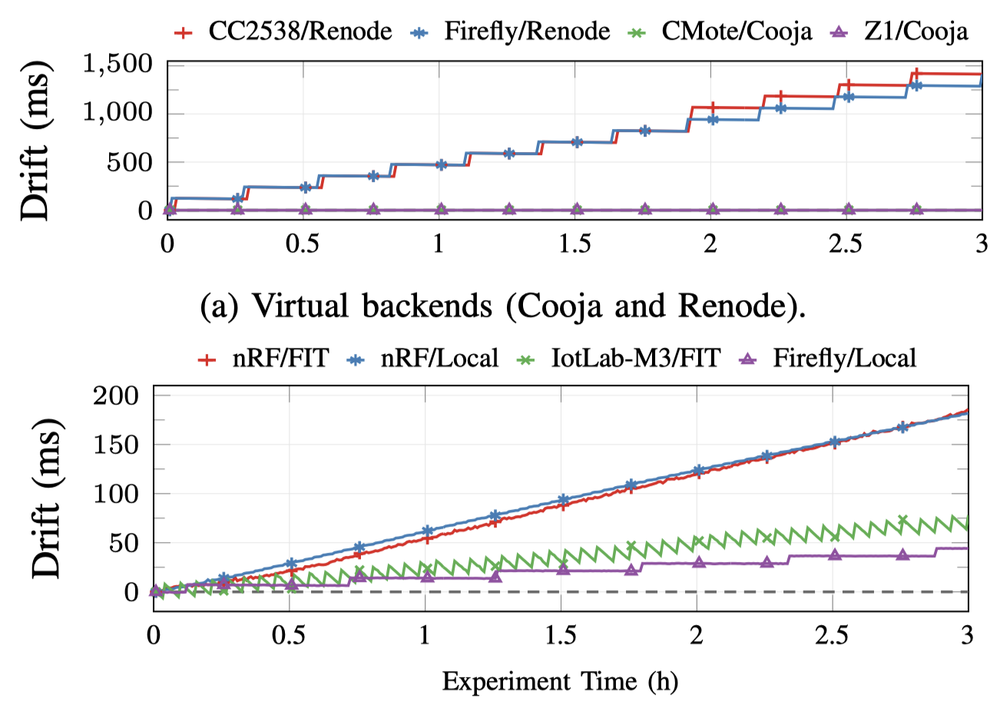

# 5. Clock-Drift Comparison

*Not part of the paper.* Quantifies how faithfully each backend's clock tracks
real time over a multi-hour run — a practical concern for any study that
correlates events across nodes or across backends.

## Experiment

A two-node UDP topology: the client sends one datagram every 30s (360 sends,
+-3h per backend) and logs each send; the server logs each reception. A
`DriftListener` compares every send's framework-reported timestamp against the
wall-clock time expected from the send cadence and accumulates the difference.

The host clock (NTP-synchronised, or a sub-µs monotonic kernel clock for Local)
is the reference, so the measured drift reflects the cumulative disagreement
between the device timer and the host along the whole serial path, not an
isolated oscillator characterisation.

Variants (Contiki-NG only): CoojaMote (driftless simulation), Zolertia Z1 (MSPSim
emulation), Firefly (Renode and local hardware), IoT-LAB M3 (FIT IoT-LAB
Grenoble), nRF52840-DK (FIT IoT-LAB Saclay).

<div align=center></div>

## Findings

- **Virtual backends.** Both Cooja configurations show effectively zero drift
  (0.00 ms and 0.35 ms), confirming Cooja's discrete-event scheduler advances
  virtual time deterministically. Renode differs sharply: both CC2538 platforms
  accumulate +-1414 ms over 3h in a staircase (-+125 ms every +-32 packets, with a
  slow -+0.2 ms/packet decline between jumps), and the two traces are nearly
  identical — the drift originates in Renode's emulation of the CC2538 sleep-timer
  peripheral, not in platform-specific code.
- **Hardware backends.** The two nRF52840-DK curves (Local, FIT IoT-LAB) drift
  near-linearly to 182 ms and 186 ms (RTC clocked by the 32.768 kHz LFXO); the
  <4 ms spread between different boards on different backends confirms the
  framework adds no timing distortion. The Firefly (CC2538) reaches only 44 ms
  (Sleep Timer driven by the 32.768 kHz XOSC); the IoT-LAB M3 (STM32F103) reaches
  78 ms with a sawtooth from SysTick housekeeping at 128 Hz.
- **Implications.** The framework faithfully exposes each backend's *native*
  timing behaviour because it does not interpose a normalisation layer. Practical
  guidance: Cooja gives a deterministic timeline for correctness testing; Renode
  runs faster than real time but cannot be trusted for sub-second timing on CC2538
  targets; hardware exposes real oscillator behaviour that must be accounted for
  in timing-critical evaluations.

## Layout

- `experiment_drift.py` — the variants and the `DriftListener` (writes CSV).
- `fig-drifts.png` — the figure above.

## Running

```bash
python experiment_drift.py
```

Writes one `(request, observed, expected, drift)` CSV per run under `data/`.
